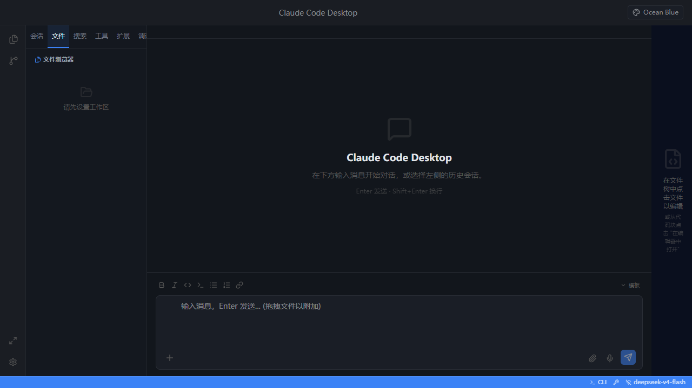

# Claude Code Desktop

<div align="center">
  
  <br />
  <strong>A full-featured desktop GUI for Claude Code</strong>
  <br />
  Built with Tauri 2 + React 19
</div>

## Features

### 🎨 Theme System
- **Visual decoration engine** — background images, gold borders, gradient bubbles, glow animations
- **Built-in themes** — fully themed visual experience with custom backgrounds
- **Custom Theme Editor** — create and edit your own themes with live preview
- **45+ CSS variables** — full control over colors, borders, backgrounds, and decorative elements

### 🧩 Extension Marketplace
- **Open VSX integration** — search and install extensions directly from the marketplace
- **VS Code-style compact UI** — familiar browsing and installation experience
- **Extension host** — run community extensions with sandboxed execution

### 🛠 Developer Tools
- **Monaco Code Editor** — full-featured code editing with syntax highlighting
- **Diff Viewer** — visual file comparison
- **Terminal** — integrated terminal via xterm.js
- **LSP Support** — language server protocol integration for code intelligence
- **DAP Support** — debug adapter protocol for debugging
- **Output Panel** — view extension and task output

### 🔧 Utility Panels
- **File Explorer** — browse and manage project files
- **Global Search** — full-text search across files
- **Git Integration** — status, diff, commit, branch management, stash
- **File History** — track file changes
- **Tasks Panel** — manage and run tasks
- **Problems Panel** — view diagnostics and errors
- **Snippets** — code snippet management
- **Timeline** — project activity timeline

### 🖥️ Debug Panels
- Call Stack, Variables, Watch, Console
- Breakpoints, Debug Toolbar
- Integrated debugging experience

### 🌐 Other
- **Command Palette** — quick access to all commands
- **Settings Editor** — JSON settings and keybindings editor
- **Launch Config Editor** — debug launch configuration
- **NPM Scripts Panel** — run npm scripts with one click
- **Context Menu** — right-click actions throughout
- **Toast Notifications** — non-intrusive feedback
- **i18n Support** — internationalization ready

## Tech Stack

| Layer | Technology |
|-------|-----------|
| Desktop Shell | [Tauri 2](https://v2.tauri.app) |
| Frontend | [React 19](https://react.dev) + [TypeScript](https://www.typescriptlang.org) 6 |
| Styling | [Tailwind CSS 4](https://tailwindcss.com) + CSS Variables |
| State | [Zustand](https://github.com/pmndrs/zustand) |
| Build | [Vite 8](https://vitejs.dev) |
| Editor | [Monaco Editor](https://microsoft.github.io/monaco-editor/) |
| Terminal | [xterm.js](https://xtermjs.org) |
| Icons | [Lucide](https://lucide.dev) |
| Rust Backend | [Reqwest](https://docs.rs/reqwest/) + [Tokio](https://tokio.rs) |

## Getting Started

### Prerequisites

- [Node.js](https://nodejs.org) 20+
- [pnpm](https://pnpm.io)
- [Rust](https://www.rust-lang.org) (for Tauri builds)
- [Microsoft Visual Studio Build Tools](https://visualstudio.microsoft.com/downloads/#build-tools-for-visual-studio-2022) with "Desktop development with C++" workload (Windows only)

### Install

```bash
git clone https://github.com/xinhui1916/GUI.git
cd GUI
pnpm install
pnpm tauri dev    # Development mode
pnpm tauri build  # Production build
```

### Development

Start the Vite dev server separately for faster iteration:

```bash
pnpm dev
```

Then in another terminal:

```bash
pnpm tauri dev
```

## Project Structure

```
src/
├── components/    # React UI components (45+ panels and views)
├── stores/        # Zustand state stores
├── theme/         # Theme system (editor, switcher, custom theme store)
├── lib/           # Utilities, IPC bridge, extension host
├── hooks/         # Custom React hooks
├── index.css      # Global styles
├── App.tsx        # Main app layout
└── main.tsx       # Entry point

src-tauri/
├── src/           # Rust backend (commands, LSP, DAP, FS, Git, etc.)
└── Cargo.toml     # Rust dependencies
```

## Configuration

- **API Settings**: Configure your Claude Code API endpoint in the settings dialog
- **Themes**: Use the theme editor to customize appearance or create your own
- **Keybindings**: Customize keyboard shortcuts via the keybindings editor
- **Extensions**: Browse and install extensions from the Open VSX marketplace

## License

MIT
